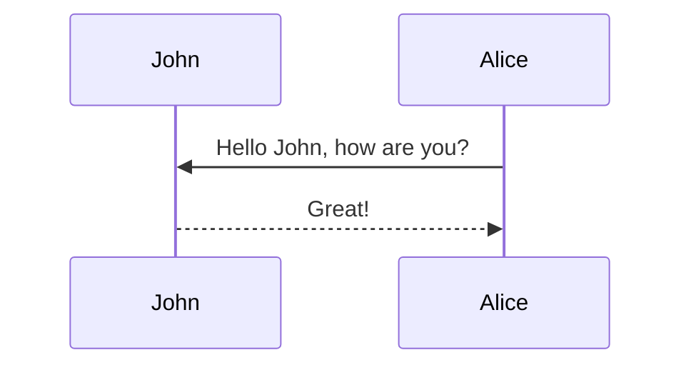

# Test

This includes some formatting tests for debugging.

* a
* b
* c

Following paragraph.

1. Item 1
1. Item 2
1. Item 3


[TOC]: # "Table of contents"

> Note that this is generated by flexmark

## Tests

### hljs highlighting

```javascript
var s = "JavaScript syntax highlighting";
alert(s);
```
 
```python
s = "Python syntax highlighting"
print s
```
 
```
No language indicated, so no syntax highlighting. 
But let's throw in a <b>tag</b>.
```

### MermaidJS diagrams



## Extension tests 

### GFM tasklists

* [ ] Task A
* [x] Task B

### GFM Tables

Colons can be used to align columns.

| Tables        | Are           | Cool  |
| ------------- |:-------------:| -----:|
| col 3 is      | right-aligned | $1600 |
| col 2 is      | centered      |   $12 |
| zebra stripes | are neat      |    $1 |

There must be at least 3 dashes separating each header cell.
The outer pipes (|) are optional, and you don't need to make the 
raw Markdown line up prettily. You can also use inline Markdown.

Markdown | Less | Pretty
--- | --- | ---
*Still* | `renders` | **nicely**
1 | 2 | 3
